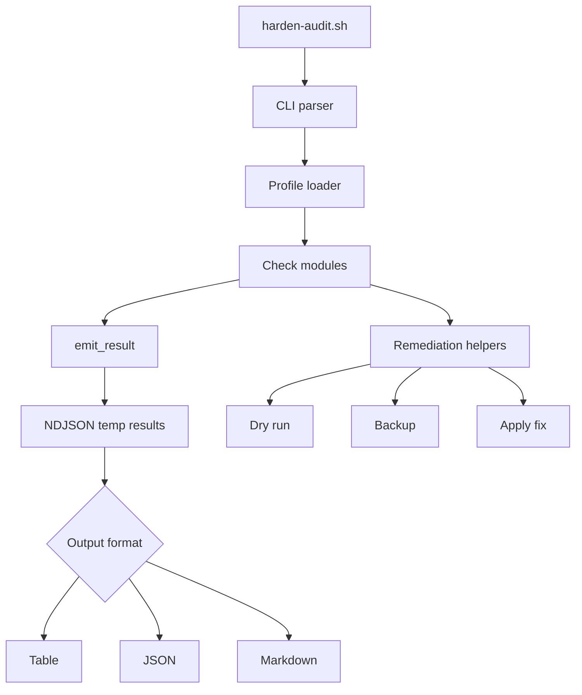

# Linux Hardening Auditor & Remediator


A Bash-driven Linux hardening auditor that checks common host security controls, reports structured evidence, and optionally applies safe, idempotent remediations.

## Why this project exists

Security teams need small, reviewable tools that can answer a practical question quickly: "Is this Linux host configured with sane baseline hardening controls?" This project focuses on transparent Bash logic, readable evidence, and cautious remediation rather than hiding behavior behind a large framework.

## What this is

- A local Linux hardening auditor for common defensive configuration checks.
- A Bash-first portfolio project that demonstrates practical security engineering.
- A tool that can output human-readable Markdown or machine-readable JSON.
- A remediator for a limited set of safe, scoped fixes.
- A testable project with Bats coverage for CLI behavior, output, SSH checks, and remediation idempotency.

## What this is not

- Not a complete CIS scanner.
- Not CIS-certified.
- Not a vulnerability scanner.
- Not a replacement for configuration management, EDR, patch management, or enterprise compliance tooling.
- Not something to run with `--fix` on production without review and backups.

The checks are inspired by common Linux hardening guidance and benchmark themes, but this project intentionally avoids claiming full benchmark coverage.

## 3-step quick start

### 1. Prerequisites

Required:

| Tool | Purpose |
|---|---|
| Bash 5.x | Runs the auditor scripts |
| jq | Builds JSON and Markdown reports safely |
| coreutils/findutils | Provides commands such as `stat`, `find`, `chmod`, and `cp` |

Optional:

| Tool | Purpose |
|---|---|
| Bats | Runs the test suite |
| OpenSSH server | Enables effective SSH configuration checks with `sshd -T` |
| Docker CLI | Enables container socket mount inspection |
| ufw, firewalld, or nft | Enables firewall status checks |

### 2. Setup

```bash
git clone https://github.com/YOUR-USERNAME/linux-hardening-auditor.git
cd linux-hardening-auditor
chmod +x harden-audit.sh
```

### 3. Run

Generate a Markdown report:

```bash
./harden-audit.sh --profile baseline --format markdown
```

Generate JSON for automation:

```bash
./harden-audit.sh --profile baseline --format json | jq
```

Preview fixes without changing the system:

```bash
sudo ./harden-audit.sh --fix --dry-run
```

Apply available fixes with backups:

```bash
sudo ./harden-audit.sh --fix --backup /var/backups/hardenkit
```

## Common commands

| Command | Description |
|---|---|
| `./harden-audit.sh --format table` | Default terminal-friendly summary |
| `./harden-audit.sh --format json` | Structured output for automation |
| `./harden-audit.sh --format markdown` | Report format for documentation or tickets |
| `./harden-audit.sh --check SSH-001 --format json` | Run one check by ID |
| `sudo ./harden-audit.sh --fix --dry-run` | Show intended remediation actions only |
| `sudo ./harden-audit.sh --fix --backup /var/backups/hardenkit` | Apply scoped fixes and back up changed files |

## Checks included

| ID | Check | Risk | Auto-fix behavior |
|---|---|---:|---|
| SSH-001 | SSH root login disabled | High | Gated by profile setting |
| SSH-002 | SSH password authentication disabled | High | Gated by profile setting |
| SUDO-001 | `/etc/sudoers` owner and mode | High | Yes |
| USER-001 | Inactive local human users reviewed | Medium | No by default |
| FS-001 | World-writable directories have sticky bit | Medium | Yes, scoped |
| FW-001 | Host firewall appears active | Medium | No by default |
| UMASK-001 | Default umask is restrictive | Low | Yes |
| DOCKER-001 | Docker socket is not broadly exposed | Critical | Partial |
| CRON-001 | Cron files are not group/world writable | High | Yes, scoped |

More detail is available in [`docs/checks.md`](docs/checks.md) and [`docs/risk-model.md`](docs/risk-model.md).

## Architecture



## Project layout

```text
.
├── harden-audit.sh          # Main entrypoint
├── checks/                  # Individual audit checks
├── lib/                     # Shared CLI, output, profile, and remediation helpers
├── profiles/                # Baseline profile settings
├── docs/                    # Check documentation and risk model
├── tests/                   # Bats tests
└── .github/workflows/       # Optional Bats-only CI workflow
```

## Safety model

The project is designed to be cautious by default:

- Audit mode does not require root for all checks.
- Remediation requires `--fix`.
- `--dry-run` shows intended changes without modifying files.
- `--backup DIR` copies changed files before editing.
- Risky controls, such as SSH authentication changes and firewall enablement, are gated or audit-only by default.
- Fixes are written to be idempotent, meaning repeated runs should not duplicate configuration lines or keep changing an already-correct file.

## Output model

Every check emits the same fields:

```json
{
  "id": "UMASK-001",
  "title": "Default umask is restrictive",
  "risk": "low",
  "status": "fail",
  "evidence": "UMASK 022; expected 027",
  "recommendation": "Set UMASK 027 in /etc/login.defs and review PAM/shell-specific overrides.",
  "fix_available": true,
  "changed": false
}
```

Statuses:

| Status | Meaning |
|---|---|
| pass | The host appears to meet the check condition |
| fail | The host does not meet the check condition |
| warn | The finding may be acceptable depending on context |
| skip | The check could not run because a dependency or file was missing |
| error | The check or remediation encountered an unexpected failure |
| info | Informational result only |

## Testing

This project intentionally does not require a Makefile or shell linters.

Run tests directly with Bats:

```bash
bats tests
```

Run a Bash syntax check without any linter:

```bash
for file in harden-audit.sh lib/*.sh checks/*.sh; do
  bash -n "$file"
done
```

## Configuration

The default profile is [`profiles/baseline.conf`](profiles/baseline.conf). Important settings include:

| Setting | Purpose | Default |
|---|---|---|
| `BASELINE_UMASK` | Expected default umask | `027` |
| `MAX_INACTIVE_DAYS` | Target review window for inactive users | `90` |
| `AUTO_FIX_SSH` | Allows SSH hardening fixes when set to `1` | `0` |
| `AUTO_FIX_FIREWALL` | Reserved for future firewall remediation | `0` |
| `AUTO_FIX_INACTIVE_USERS` | Reserved for future account lock remediation | `0` |
| `SCAN_ONE_FILESYSTEM` | Keeps filesystem scan on one filesystem | `1` |
| `WORLD_WRITABLE_MAX_RESULTS` | Limits world-writable directory findings | `50` |

## Contribution workflow

Suggested branch names:

```text
feature/add-check-id
fix/remediation-idempotency
chore/docs-update
```

Before opening a pull request:

```bash
bats tests
for file in harden-audit.sh lib/*.sh checks/*.sh; do bash -n "$file"; done
```

A good pull request should include:

- A short description of the risk being checked.
- The files and commands inspected by the check.
- At least one Bats test for the new behavior.
- Clear remediation safety notes if `--fix` is supported.

## Known limitations

- Linux distributions handle SSH, PAM, cron, firewall services, and login defaults differently.
- LDAP, SSSD, Active Directory, and enterprise IAM users are not fully evaluated.
- Firewall checks do not prove that the policy is strong; they only detect common firewall tooling state.
- SSH remediation uses a drop-in file and then validates effective behavior, but local include ordering can still require administrator review.
- Docker checks focus on socket exposure and obvious TCP API exposure, not full container runtime security.

## Roadmap

- Add `--list-checks`.
- Add severity filtering such as `--severity high`.
- Add `--fail-on medium` for CI/CD usage.
- Add an optional HTML report.
- Add distro-specific profiles for Ubuntu, Debian, Rocky, AlmaLinux, and Fedora.
- Add a demo lab with intentionally weak configurations.

## License

MIT License. See `LICENSE` if included in your repository.
